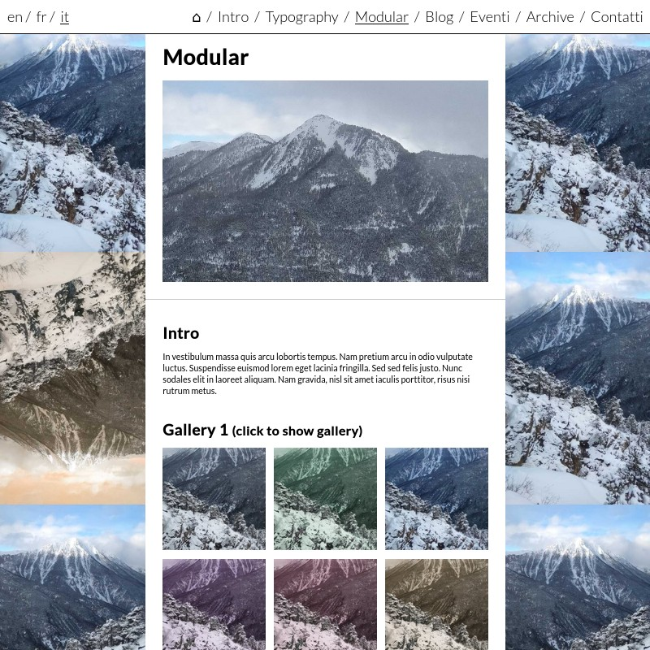

# Grama Skeleton for Grav

Skelgrama is a skeleton for [the grav CMS](https://getgrav.org/) using the [grama](https://framagit.org/squeak/grama) theme. It allows you to create easily a website and blog that you can edit from markdown files or with the grav administrative interface.

The grama theme goal is to provide a simple multilingual website. It makes it easy to create a website with a few pages, a blog posts section, some events cards in a blogging style, a basic wiki...

This skeleton and theme don't include by default reference to any social network, analytics scripts, or any GAFAM+ fonts or libraries. This a design choice to enhance site owners/visitors privacy. You may add any of those elements on your website by yourself, but please don't ask me to include them by default, since I designed this theme with the explicit goal not to have those elements baked in a site.

## Usage

To install grav, check out the [general Grav installation instructions](http://learn.getgrav.org/basics/installation).

This skeleton contains example pages and configuration. To use it you can simply extract it's contents into your grav site `user` folder. Or follow the instructions available [here](https://getgrav.org/downloads/skeletons).

For more info on how to setup a site using grama, check the [grama theme documentation](https://framagit.org/squeak/grama/-/blob/master/README.md).

## Credits

Skelgrama is of any use only thanks to [the grav CMS](https://getgrav.org) which makes 99% of the work of making your website run, in fact.
Some stuff are made much easier by the following amazing javascript libraries: [jquery](https://jquery.com/) and [underscorejs](https://underscorejs.org/).
The intro and typography page are adapted from the skeleton installed by default by grav.
The skeleton logo is based on the grav logo.

## License

Skelgrama and grama use the AGPL license, so you're free to use, share, modify, republish codes and contents here only in fully free software and projects, and on infrastructures that provide services using exclusively free software compatible with the AGPL license. This work is free software, and wants to remain it, so you're not welcome to use it if you want to turn it into non-free software.
You're also very welcome to contribute to this work, and I'll do my best to integrate proposed contributions so that everyone using this theme and skeleton can benefit improvements.

See [LICENSE](LICENSE) for the actual license text.
